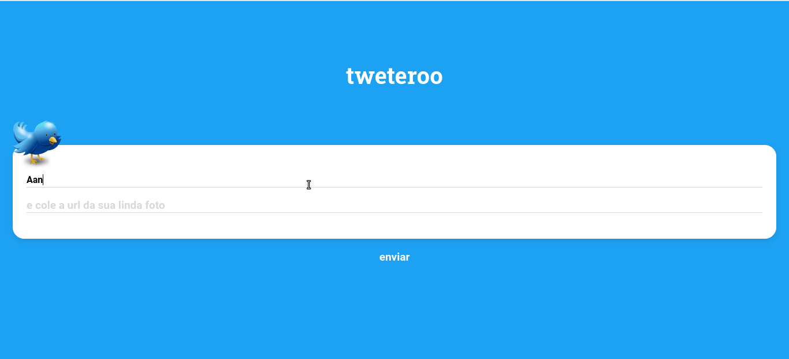

### Projeto 25 Tweterro POO

<div align="center">

  <h3>Built With</h3>

    
  
  
  
  <!-- Badges source: https://dev.to/envoy_/150-badges-for-github-pnk -->
</div>

<br/>

# Sumário

- [Descrição](#description)
- [Funcionalidades](#app)
- [Rodar localmente](#run-locally)

#

<div id='description'/>

## Descrição

Tweterro POO é um projeto refatorado em orientado a objetos com classes.

Código original: <a href="./assets/files/tweteroo__base.zip" download>Click to Download</a>

#

<div id='app'/>

## Funcionalidades

- Fazer cadastro
- Vizualizar e postar tweets

<h1 align="center" >

</h1>

<div id='run-locally'/>

## Rodar localmente

Clone o projeto

```bash
  git clone https://github.com/ThVinicius/Tweteroo-Orientado-a-Objetos-front-end.git
```

Vá para o diretório do projeto

```bash
  cd Tweteroo-Orientado-a-Objetos-front-end
```

Instale as dependências

```bash
  npm install
```

Inicie o servidor

```bash
  npm run dev
```

</br>

## Acknowledgements

- [Awesome Badges](https://github.com/Envoy-VC/awesome-badges)

</br>
